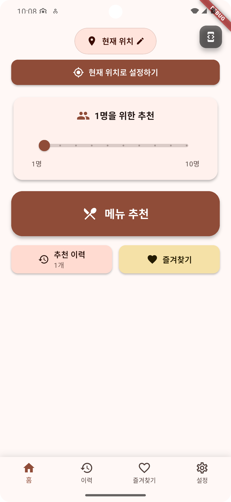
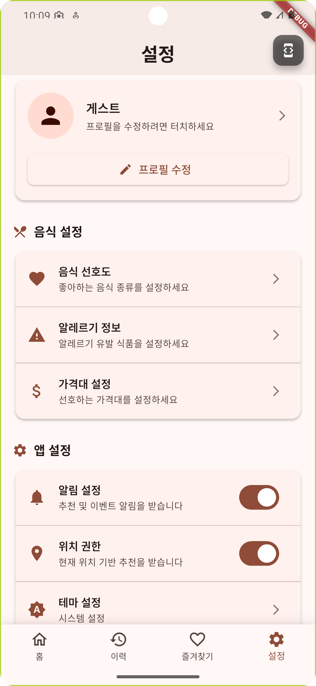
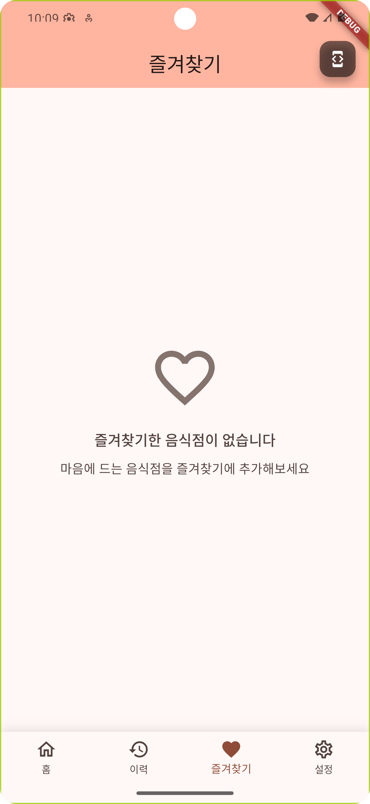
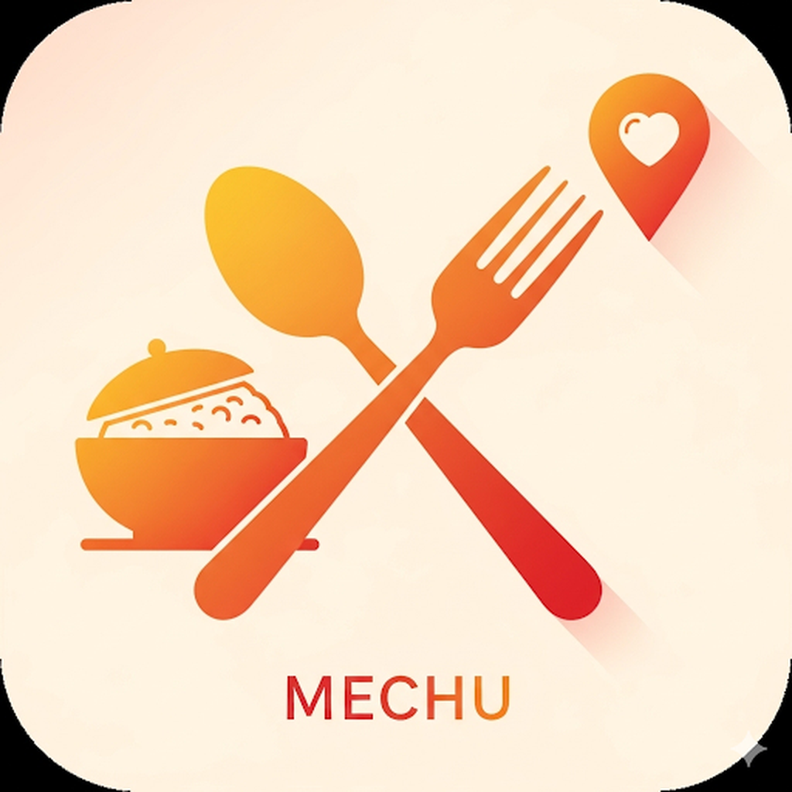

# 메추 (Mechu) - 맛집 추천 앱

> **메뉴 고민 끝!** AI가 추천하는 맞춤 음식점과 메뉴를 한 번에 찾아보세요.

## 📱 앱 소개

메추는 당신의 입맛과 상황에 맞는 완벽한 음식점을 찾아주는 스마트 맛집 추천 앱입니다.

### ✨ 주요 기능
- **스마트 메뉴 추천**: 기분, 인원수, 위치를 고려한 맞춤 추천
- **실시간 위치 기반**: 현재 위치 주변의 최고 맛집 발견
- **다양한 검색**: 한식, 중식, 일식, 양식까지 모든 음식 카테고리
- **즐겨찾기**: 마음에 든 음식점을 저장하고 관리
- **추천 기록**: 과거 추천 내역을 확인하고 재방문

### 📸 스크린샷

<div align="center">
  
  
  
  
  
</div>

## 🏗️ 기술 스택

- **Framework**: Flutter 3.x
- **Language**: Dart
- **State Management**: Provider Pattern
- **API**: Kakao Local API, Kakao Map
- **Location**: Geolocator, Permission Handler
- **Storage**: SharedPreferences
- **Network**: HTTP, Connectivity Plus

## 🚀 설치 및 실행

### 사전 요구사항
- Flutter SDK 3.0+
- Android Studio / Xcode
- Kakao API 키

### 실행 방법
```bash
# 의존성 설치
flutter pub get

# 앱 실행
flutter run
```

## 📋 기능 세부사항

### 🎯 메뉴 추천 시스템
- 사용자 기분 상태 반영
- 인원수별 맞춤 추천
- 위치 기반 실시간 검색
- 과거 선호도 학습

### 🗺️ 위치 기반 서비스
- GPS 자동 위치 감지
- 수동 위치 설정 가능
- 주변 맛집 반경 검색
- 카카오 맵 연동

### 💾 데이터 관리
- 즐겨찾기 로컬 저장
- 추천 기록 관리
- 오프라인 모드 지원
- 사용자 설정 동기화

## 🏪 다운로드

곧 다음 플랫폼에서 만나보실 수 있습니다:

- 📱 **App Store**: 심사 중
- 🤖 **Google Play**: 심사 중

## 📄 개인정보 처리방침

### 1. 개인정보의 처리 목적
- **위치 정보**: 맛집 검색 및 추천 서비스 제공
- **사용자 설정**: 앱 개인화 및 사용자 경험 개선  
- **검색 기록**: 추천 품질 향상 (익명화 처리)

### 2. 개인정보의 처리 및 보유 기간
- **위치 정보**: 서비스 이용 시에만 임시 처리, 즉시 삭제
- **사용자 설정**: 앱 삭제 시까지 사용자 기기에만 로컬 저장
- **검색 기록**: 최대 1년간 보관 후 자동 삭제

### 3. 개인정보의 제3자 제공
- **카카오 API**: 맛집 정보 검색 목적으로만 위치 정보 전송
- **제3자 제공 없음**: 그 외 어떠한 제3자에게도 개인정보를 제공하지 않습니다

### 4. 개인정보 보호 조치
- **데이터 최소화**: 서비스 제공에 필요한 최소한의 정보만 수집
- **로컬 저장 우선**: 민감한 정보는 사용자 기기에만 저장
- **암호화**: 네트워크 통신 시 HTTPS 암호화 적용

### 5. 개인정보 보호책임자
- **개발자**: 메추 개발팀
- **이메일**: mechu.support@example.com

## 📜 이용약관

### 제1조 (목적)
본 약관은 메추 앱이 제공하는 맛집 추천 서비스의 이용조건 및 절차를 규정함을 목적으로 합니다.

### 제2조 (서비스의 내용)
1. **위치 기반 맛집 검색 및 추천**
2. **개인 맞춤형 메뉴 추천 서비스**
3. **즐겨찾기 및 추천 기록 관리**
4. **카카오 맵 연동 서비스**

### 제3조 (서비스 이용)
1. 본 서비스는 **무료**로 제공됩니다
2. 정확한 서비스 제공을 위해 **위치 권한 허용**이 필요합니다
3. 실시간 정보 제공을 위해 **네트워크 연결**이 필요합니다

### 제4조 (금지행위)
1. 타인의 개인정보를 도용하는 행위
2. 서비스의 안정성을 해치는 행위
3. 기타 관련 법령에 위배되는 행위

### 제5조 (면책조항)
1. **천재지변, 통신장애** 등 불가항력으로 인한 서비스 중단
2. **제3자 제공 정보**의 정확성에 대한 책임
3. **사용자의 귀책사유**로 인한 손해

### 제6조 (분쟁해결)
본 약관과 관련된 분쟁은 **대한민국 법률**에 따라 해결됩니다.

## 🌍 위치기반서비스 이용약관

### 제1조 (목적)
위치정보의 보호 및 이용 등에 관한 법률에 따라 위치기반서비스 제공을 위한 약관을 정합니다.

### 제2조 (서비스 내용)
1. **현재 위치 기반 맛집 검색**
2. **지역별 맛집 추천**
3. **카카오 맵 연동 경로 안내**

### 제3조 (위치정보 수집방법)
1. **GPS**를 통한 현재 위치 수집
2. **사용자 직접 입력** 위치 정보

### 제4조 (위치정보 이용·제공)
- **수집목적**: 맛집 검색 및 추천 서비스 제공
- **이용범위**: 서비스 제공에 필요한 최소한의 범위
- **제공대상**: 카카오 API (맛집 정보 검색 목적에 한함)

### 제5조 (개인위치정보 보유기간)
**즉시 삭제** (일시적 처리 후 즉시 파기)

### 제6조 (손해배상)
고의 또는 중과실로 인한 손해에 대해서만 배상책임을 집니다.

### 제7조 (분쟁조정)
방송통신위원회 개인정보 분쟁조정위원회에 조정을 신청할 수 있습니다.

## 🤝 지원 및 문의

문제가 발생하거나 문의사항이 있으시면 언제든 연락해주세요:

### 📧 연락처
- **지원 이메일**: mechu.support@example.com
- **개발자**: 메추 개발팀

### 🐛 버그 신고 및 기능 제안
- **버그 리포트**: [GitHub Issues](https://github.com/hjkim909/Mechu/issues)
- **기능 제안**: [GitHub Discussions](https://github.com/hjkim909/Mechu/discussions)

### ⚡ 응답 시간
- **일반 문의**: 24시간 이내
- **긴급 버그**: 즉시 대응
- **기능 제안**: 1주일 이내 검토

## 🎯 로드맵

### 🚀 출시 예정 기능
- **사용자 리뷰 시스템**: 맛집 평점 및 후기
- **개인화 알고리즘**: AI 기반 취향 학습
- **소셜 기능**: 친구와 맛집 공유
- **다국어 지원**: 영어, 일어, 중국어

### 📈 업데이트 계획
- **v1.1**: 리뷰 시스템 추가
- **v1.2**: 개인화 추천 고도화
- **v1.3**: 소셜 기능 및 공유
- **v2.0**: 글로벌 서비스 확장

## 📝 라이선스

이 프로젝트는 **MIT 라이선스** 하에 배포됩니다.

```
MIT License

Copyright (c) 2024 Mechu Development Team

Permission is hereby granted, free of charge, to any person obtaining a copy
of this software and associated documentation files (the "Software"), to deal
in the Software without restriction, including without limitation the rights
to use, copy, modify, merge, publish, distribute, sublicense, and/or sell
copies of the Software, and to permit persons to whom the Software is
furnished to do so, subject to the following conditions:

The above copyright notice and this permission notice shall be included in all
copies or substantial portions of the Software.

THE SOFTWARE IS PROVIDED "AS IS", WITHOUT WARRANTY OF ANY KIND, EXPRESS OR
IMPLIED, INCLUDING BUT NOT LIMITED TO THE WARRANTIES OF MERCHANTABILITY,
FITNESS FOR A PARTICULAR PURPOSE AND NONINFRINGEMENT. IN NO EVENT SHALL THE
AUTHORS OR COPYRIGHT HOLDERS BE LIABLE FOR ANY CLAIM, DAMAGES OR OTHER
LIABILITY, WHETHER IN AN ACTION OF CONTRACT, TORT OR OTHERWISE, ARISING FROM,
OUT OF OR IN CONNECTION WITH THE SOFTWARE OR THE USE OR OTHER DEALINGS IN THE
SOFTWARE.
```

---

<div align="center">
  
  
  **맛있는 하루의 시작, 메추와 함께하세요! 🍴**
  
  [](https://github.com/hjkim909/Mechu/stargazers)
  [](https://github.com/hjkim909/Mechu/network)
  [](https://github.com/hjkim909/Mechu/issues)
</div>